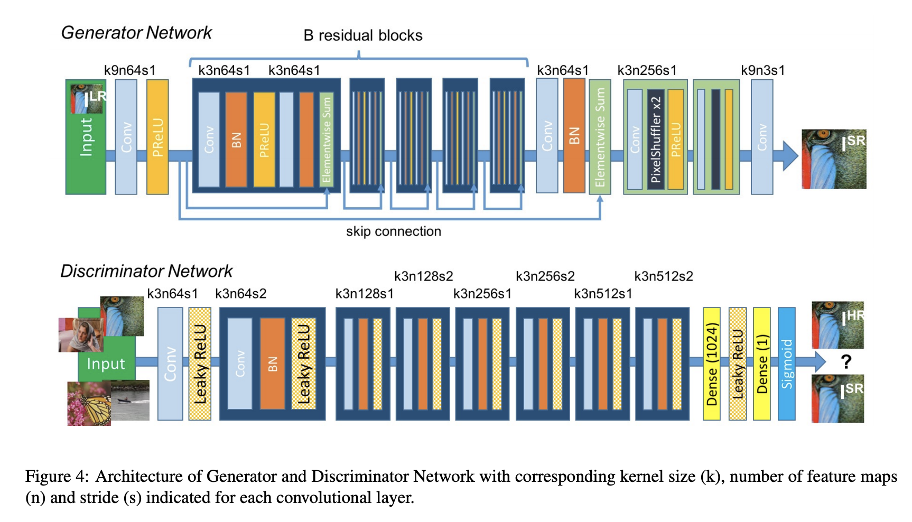

# A PyTorch SRGAN tutorial (Russian)

Этот репозиторий является руководством по обучению и использованию модели SRGAN (Super Resolution GAN). 
*Предполагается, что у читателя имеются базовые знания о нейронных сетях!*

## Содержание
Туториал состоит из 4 основных частей:

- [Описание задачи и сети SRGAN](https://github.com/boomb0om/PyTorch-SRGAN-tutorial#%D0%BE-%D0%B7%D0%B0%D0%B4%D0%B0%D1%87%D0%B5-sisr-%D0%B8-srgan)
- [Подготовка датасета](https://github.com/boomb0om/PyTorch-SRGAN-tutorial#%D0%BF%D0%BE%D0%B4%D0%B3%D0%BE%D1%82%D0%BE%D0%B2%D0%BA%D0%B0-%D0%B4%D0%B0%D1%82%D0%B0%D1%81%D0%B5%D1%82%D0%B0)
- [Обучение](https://github.com/boomb0om/PyTorch-SRGAN-tutorial#%D0%BE%D0%B1%D1%83%D1%87%D0%B5%D0%BD%D0%B8%D0%B5)
- [Запуск SRGAN и проверка качества ее работы](https://github.com/boomb0om/PyTorch-SRGAN-tutorial#%D0%B7%D0%B0%D0%BF%D1%83%D1%81%D0%BA-%D0%BC%D0%BE%D0%B4%D0%B5%D0%BB%D0%B8)

## О задаче SISR и SRGAN

**SISR** (Single Image Super Resolution) - задача увеличения разрешения *одного* изображения. Из входного изображения с низким разрешением (Low Resolution, LR) необходимо реконструировать изображение с высоким разрешением (Super Resolution, SR), которое будет максимально похоже на изначальное фото (High Resolution, HR).

Одни из самых известных методов увеличения разрешения изображения - это [билинейная](https://ru.wikipedia.org/wiki/%D0%91%D0%B8%D0%BB%D0%B8%D0%BD%D0%B5%D0%B9%D0%BD%D0%B0%D1%8F_%D0%B8%D0%BD%D1%82%D0%B5%D1%80%D0%BF%D0%BE%D0%BB%D1%8F%D1%86%D0%B8%D1%8F) и [бикубическая](https://ru.wikipedia.org/wiki/%D0%91%D0%B8%D0%BA%D1%83%D0%B1%D0%B8%D1%87%D0%B5%D1%81%D0%BA%D0%B0%D1%8F_%D0%B8%D0%BD%D1%82%D0%B5%D1%80%D0%BF%D0%BE%D0%BB%D1%8F%D1%86%D0%B8%D1%8F) интерполяции. Эти методы работают быстро, но выдают результат с чрезмерно гладкой текстурой. Более мощные подходы основаны на использовании нейросетей, которых обучают генерировать изображения высокого качества из изображений с низким качеством. 

Для многих подходов, использующих нейронные сети, применяются *попиксельные (pixel-wise)* функции потерь (например, *MSE* или *MAE*). Минимизация такой ошибки приводит к тому, что модель находит средние вероятностные решения для каждого пикселя, поэтому они получаются слишком гладкими и, следовательно, имеют низкое качество восприятия, как показано на рисунке ниже.  

**SRGAN**

[Оригинальная статья](https://arxiv.org/pdf/1609.04802.pdf)

SRGAN (Super Resolution GAN) - подход к решению задачи SISR, основанный на GAN-ах (генеративно-состязательных сетях).

[Генеративно-состязательные сети](https://ru.wikipedia.org/wiki/%D0%93%D0%B5%D0%BD%D0%B5%D1%80%D0%B0%D1%82%D0%B8%D0%B2%D0%BD%D0%BE-%D1%81%D0%BE%D1%81%D1%82%D1%8F%D0%B7%D0%B0%D1%82%D0%B5%D0%BB%D1%8C%D0%BD%D0%B0%D1%8F_%D1%81%D0%B5%D1%82%D1%8C) - это алгоритм, построенный на комбинации из двух нейронных сетей, одна из которых (генератор) генерирует образцы, а другая (дискриминатор) старается отличить правильные («подлинные») образцы от неправильных.

Успех SRGAN в задаче SISR обусловлен двумя важными особенностями:

- Генеративно-состязательные сети позволяют создавать более реалистичные изображения, чем нейросети, основанные на оптимизации MSE между пикселями. Модели, ориентированные на оптимизацию MSE по пикселям, "усредняли" текстуры, что делало их чрезмерно гладкими.  Использование GAN-ов сдвигает реконструированное фото в сторону множества естественных изображений, позволяя получить более реалистичные решения.   
- Второй важной особенностью стало использование **perceptual loss**, которая основывается на евклидовых расстояниях (MSE, MAE), вычисленных в пространстве признаков глубокой сверточной нейронной сети (например, предварительно обученной VGG). Такая функция ошибки будет более инвариантна к изменениям пикселей на изображении, чем попиксельные MSE или MAE.

**Архитектура сети**

Основу генеративной сети составляют `B` residual блоков с одинаковой структурой. В каждом блоке находятся два свёрточных слоя с ядрами 3x3 и 64 каналами, за которыми расположены [batch-norm](https://habr.com/ru/post/309302/) слои. В качестве функции активации используется [PReLU (Parametric Rectified Linear Unit)](https://congyuzhou.medium.com/prelu-e0bc339d9c01). Входное изображение увеличивается попиксельно с помощью двух свёрточных слоев с операцией [PixelShuffle](https://paperswithcode.com/method/pixelshuffle) и функцией активации PReLU.

В качестве дискриминатора используется типичная для классификатора изображений архитектура с fully-connected слоями в конце.

Архитектуры генератора и дискриминатора в картинке:

## Подготовка датасета

Обучение нейронной сети будет производится на парах изображений LR-HR. Однако не обязательно заранее подготавливать LR и HR пары изображений вместе, достаточно подготовить только High Resolution фотографии. Low Resolution изображения мы сможем получить из HR изображений, уменьшив их билинейной/бикубической интерполяцией прямо во время обучения.

Этап подготовки данных описан и реализован в ноутбуке [1_create_dataset.ipynb](https://github.com/boomb0om/PyTorch-SRGAN-tutorial/blob/main/1_create_dataset.ipynb)

Датасеты, которые я рекомендую использовать:

1. DIV2K - https://data.vision.ee.ethz.ch/cvl/DIV2K/
3. FLICKR2k - https://drive.google.com/drive/folders/1AAI2a2BmafbeVExLH-l0aZgvPgJCk5Xm
4. FFHQ - https://github.com/NVlabs/ffhq-dataset

## Обучение

Обучение модели разделяют на два этапа:  сначала на обычной MSE обучают генератор и получают сеть, которую называют SRResNet. Затем обучают SRGAN, проинициализованный весами SRResNet. Такое разделение необходимо, чтобы генератор не выдавал шум на начальных стадиях обучения и дискриминатор не начинал сразу выигрывать. Это позволяет избежать попадания в нежелательный локальный минимум при обучении SRGAN.

Код для обучения SRResNet вы можете найти в ноутбуке: [2_train_srresnet.ipynb](https://github.com/boomb0om/PyTorch-SRGAN-tutorial/blob/main/2_train_srresnet.ipynb)

Обучение SRGAN реализовано в ноутбуке: [3_train_srgan.ipynb](https://github.com/boomb0om/PyTorch-SRGAN-tutorial/blob/main/3_train_srgan.ipynb)

В процессе обучения SRGAN я использовал функцию потерь, немного отличающуюся от функции потерь, описанной в [оригинальной статье](https://arxiv.org/pdf/1609.04802.pdf). 

## Запуск модели